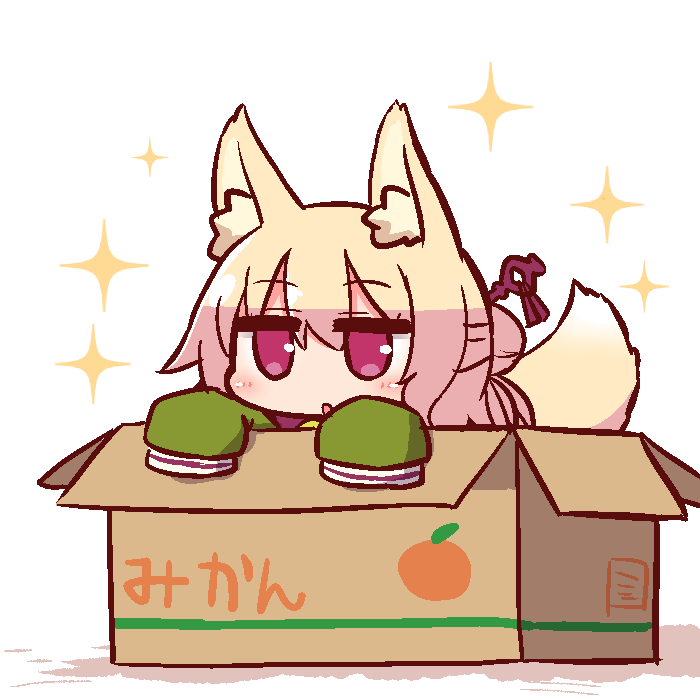
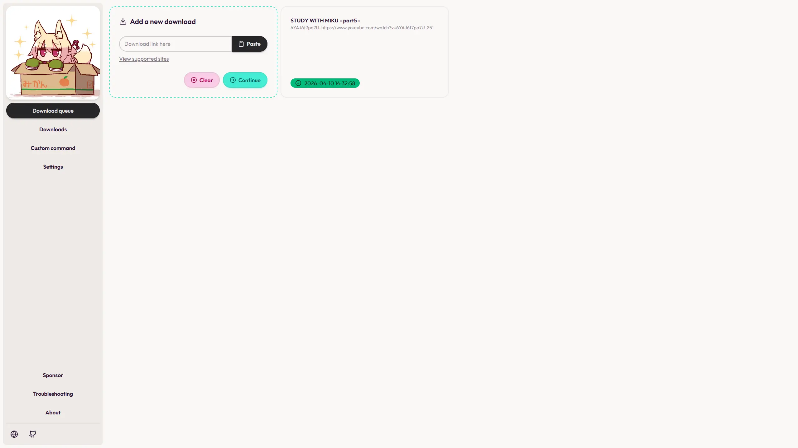
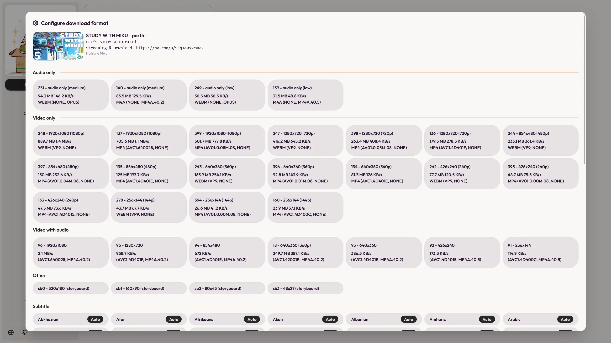

<div align="center">



# Sealed

### Blazingly fast Cross-platform Audio/Video/Subtitle Downloader
#### Built as a cross-platform alternative to [Seal](https://github.com/JunkFood02/Seal)

<!-- [](https://docs.rs/sealed/latest/sealed/) -->
<!-- [](https://crates.io/crates/sealed) -->
<!-- [](https://crates.io/crates/sealed) -->

[](https://github.com/sonicjhon1/sealed#license)

</div>

## Screenshots

### Desktop

| Queue                                               | Configure                                               |
|-----------------------------------------------------|---------------------------------------------------------|
|  |  |

## Features

- Download audio, video and subtitle files from sites supported by [yt-dlp](https://github.com/yt-dlp/yt-dlp) (formerly youtube-dl).

- GUI is easy to use and user-friendly.

## Status

This project is **under active development**. Although functional, bugs are expected at this state.

### Roadmap

The goal is to achieve feature parity with [Seal](https://github.com/JunkFood02/Seal), with more features available / supported.

- [ ] Playlist
- [ ] Embed metadata
- [ ] User settings
- [ ] Crates.io release

## Development

### Prerequisite

Ensure you have a compatible `dx` installed.

> **Note**:
> 
> You can check the Dioxus version used by this project:
> ```bash
> cargo tree -i dioxus
> ```
> And then install the matching Dioxus CLI (`dx`):
> ```bash
> cargo install --locked --profile release-max-opt --git https://github.com/DioxusLabs/dioxus dioxus-cli
> ```
> Or a specific revision of it if needed:
> ```bash
> cargo install --locked --profile release-max-opt --git https://github.com/DioxusLabs/dioxus --rev d312ef8 dioxus-cli
> ```

Clone into the repo and cd into it
```bash
git clone https://github.com/sonicjhon1/sealed && cd sealed
```

Then you can either:
- Serve the app locally
```bash
dx serve -p sealed_dioxus_ui --platform web
```

- Build the app as an executable
```bash
dx build -p sealed_dioxus_ui --release @server --platform server --target "x86_64-pc-windows-gnu" @client --platform web
```

## ⭐️ Star History

[](https://www.star-history.com/?repos=sonicjhon1%2Fsealed&type=timeline)

## 🧱 Credits

Seal is a simple GUI of [yt-dlp](https://github.com/yt-dlp/yt-dlp), based on [youtubedl-android](https://github.com/yausername/youtubedl-android)

Sealed's main idea and GUI designs are inspired by [Seal](https://github.com/JunkFood02/Seal)

Themes and components from [tailwindcss](https://tailwindcss.com/) and [DaisyUI](https://daisyui.com/)

Cross-platform framework made possible by [dioxus](https://github.com/DioxusLabs/dioxus)

Kemonomimi-chan arts by [naga_u](https://www.pixiv.net/en/users/2509595)

## License

[](https://github.com/sonicjhon1/sealed/blob/main/LICENSE)

All code in this repository is dual-licensed under either:

* MIT License ([LICENSE-MIT](LICENSE-MIT) or [http://opensource.org/licenses/MIT](http://opensource.org/licenses/MIT))
* Apache License, Version 2.0 ([LICENSE-APACHE](LICENSE-APACHE) or [http://www.apache.org/licenses/LICENSE-2.0](http://www.apache.org/licenses/LICENSE-2.0))

at your option.